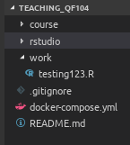
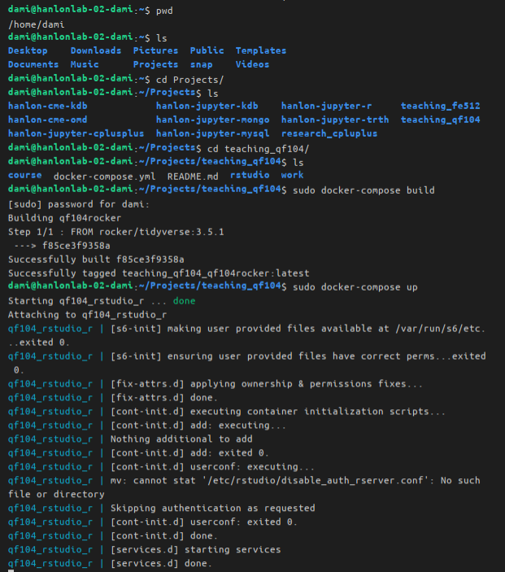
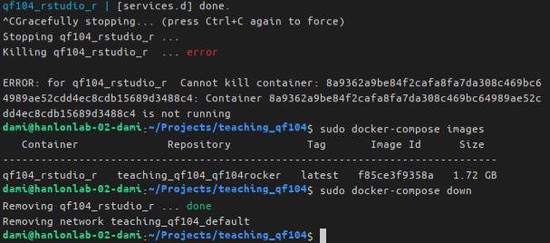
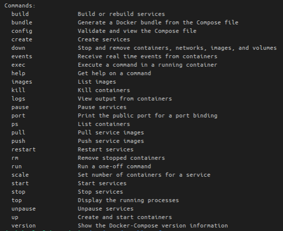
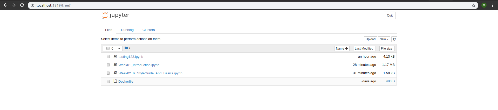

# QF-104 Slides
QF104-Data management in R slides and assignments. Spring 2020

# hanlon-jupyter-r
hanlon + jupyter + r


Run Jupyter Notebook and R in Docker.

- Step 01
    - install or upgrade your operating system to latest version
        - for mac
            - macOS Catalina
        ```
        ```
        - for windows
            - Windows 10 Pro (https://stevens.edu/msdnaa).  use your stevens email address to either login (IT confirms you should all have an account) or request an account from both:
            - [the Microsoft/Stevens website](https://e5.onthehub.com/WebStore/Account/VerifyImportedUser.aspx?ws=9a73552b-cf9b-e011-969d-0030487d8897&vsro=8)  
            - [Stevens IT Helpdesk](https://sit.teamdynamix.com/TDClient/Requests/ServiceDet?ID=19685)
        ```
        ```
        - for ubuntu and other linux os
            - [see here](https://docs.docker.com/install/linux/docker-ce/ubuntu/)
        ```
        ```

- Step 02
    - install docker, https://www.docker.com/products/docker-desktop.  
        - for mac 
            - [docker for mac](https://store.docker.com/editions/community/docker-ce-desktop-mac)
        ```
        ```
        - for windows
            - [docker for windows](https://store.docker.com/editions/community/docker-ce-desktop-windows)
            - NOTE: for windows, if you store your file in a different drive location from **C:/**, then you will need to access the docker preferences to add other Shared Folder locations, such as **D:/**
            - NOTE: follow the online docker installation instructions carefully and make sure to test the docker installation
            - NOTE: in some cases, you may need to enable virtualization on your computers
        ```
        ```

        - for ubuntu and other linux os
            - [see here](https://docs.docker.com/install/linux/docker-ce/ubuntu/) 
        ```
        ```

- Step 03
    - download the following zip file from Canvas to your computer and unzip:
        - for qf104 instructors, hanlon-jupyter-r.zip
        - for qf104 students, teaching-qf104.zip

- Step 04
    - place your scripts, data files (i.e. csv, txt, and et cetera) in the following location:

    - 

- Step 05
    - start the docker environment
        - macos, open the Terminal.app
        - windows, open the Windows Powershell Desktop app
        - linux, open Terminal

```
```

- build the environment once from the Terminal.app
```
docker-compose build
```

- create and start the environment

```
$ docker-compose up
```
- 


- turn off the container and its artifacts
    - type CTRL+C twice and then type the following
```
$ docker-compose down

```
- 

- additional docker-compose commands
```
```
- 

- Step 06
    - go to your favorite browser and enter the following
    ```
    http://localhost:1819/
    ```
    or just enter
    ```
    localhost:1819
    ```
- 

- references
    - https://choosealicense.com/
    - https://creativecommons.org/
    - https://github.com/ipython-contrib/jupyter_contrib_nbextensions
    

